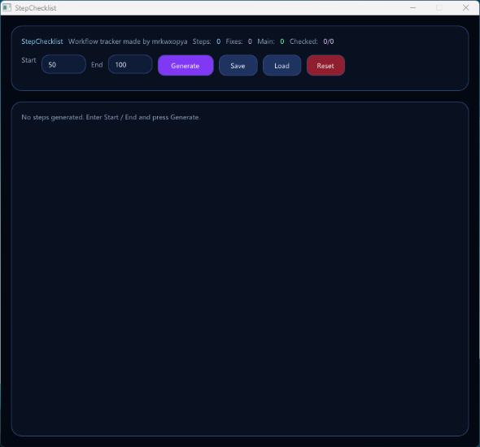

# StepChecklist

StepChecklist is a lightweight dark-mode desktop checklist app designed for tracking step-by-step development workflows.

It was built for workflows where each step needs to be confirmed manually through a simple checklist structure:

- `P` = Prompt
- `C` = Code
- `B` = Build
- `S` = Success

Each step includes a default `Main` column, and dynamic fix columns can be added when needed:

- `Fix 1`
- `Fix 2`
- `Fix 3`
- ...

Fix columns can also be deleted directly from their own column header.

---

## Preview

Add a screenshot here:

---

## Features

- Modern dark-mode desktop UI
- Built with C++ and Dear ImGui
- Fixed-size desktop window
- Step range generator
- Main checklist column
- Dynamic fix columns
- Add fix columns directly from the table header
- Delete fix columns from their own header
- Horizontal and vertical table scrolling
- Auto-save after every checkbox change
- Auto-save after generating steps
- Auto-save after adding or deleting fixes
- Simple local save file
- No account required
- No database required
- No browser required

---

## Checklist Model

Each step has the following stages:

| Key | Meaning |
| --- | ------- |
| P   | Prompt  |
| C   | Code    |
| B   | Build   |
| S   | Success |

Example:

| Step     | Main    | Fix 1   | Fix 2   |
| -------- | ------- | ------- | ------- |
| STEP 050 | P C B S | P C B S | P C B S |
| STEP 051 | P C B S | P C B S | P C B S |

---

## Save File

StepChecklist stores its data locally in:

stepchecklist.txt

The file is created next to the executable.

---

## User Installation

### Option 1: Download Release

1. Go to the Releases page.
2. Download the latest StepChecklist.zip.
3. Extract the zip file.
4. Run:

StepChecklist.exe

### Portable Folder Structure

A release package may look like this:

StepChecklist/
├─ StepChecklist.exe
├─ stepchecklist.txt
├─ glfw3.dll
├─ libgcc_s_seh-1.dll
├─ libstdc++-6.dll
└─ libwinpthread-1.dll

Some systems may not require all DLL files, but keeping them next to the executable improves portability.

---

## Developer Setup

This project is designed to be built on Windows with:

- VS Code
- MSYS2 UCRT64
- GCC / G++
- GLFW
- Dear ImGui
- OpenGL

---

## Install MSYS2 Dependencies

Open MSYS2 UCRT64 and run:

pacman -S --needed mingw-w64-ucrt-x86_64-gcc mingw-w64-ucrt-x86_64-glfw git

Verify:

g++ --version
git --version

---

## Clone Repository

git clone https://github.com/YOUR_USERNAME/StepChecklist.git
cd StepChecklist

---

## Install Dear ImGui

This project expects Dear ImGui inside:

vendor/imgui

You can clone it manually:

mkdir -p vendor
git clone --depth 1 https://github.com/ocornut/imgui vendor/imgui

Alternatively, you can use a Git submodule:

git submodule add https://github.com/ocornut/imgui vendor/imgui
git submodule update --init --recursive

---

## Build

From the project root:

.\build.ps1

Output:

StepChecklist.exe

---

## Build Script

The project uses build.ps1:

$ErrorActionPreference = "Stop"

$imgui = "vendor/imgui"

$files = @(
  "src/main.cpp",
  "$imgui/imgui.cpp",
"$imgui/imgui_draw.cpp",
  "$imgui/imgui_tables.cpp",
"$imgui/imgui_widgets.cpp",
  "$imgui/backends/imgui_impl_glfw.cpp",
"$imgui/backends/imgui_impl_opengl3.cpp"
)

g++ $files `
  -I"$imgui" `  -I"$imgui/backends"`
-std=c++17 `  -O2`
-mwindows `  -lglfw3`
-lopengl32 `  -lgdi32`
-limm32 `
-o StepChecklist.exe

Write-Host "DONE: StepChecklist.exe" -ForegroundColor Green

---

## VS Code Build Task

Create:

.vscode/tasks.json

{
"version": "2.0.0",
"tasks": [
{
"label": "Build StepChecklist",
"type": "shell",
"command": "powershell",
"args": [
"-ExecutionPolicy",
"Bypass",
"-File",
"${workspaceFolder}/build.ps1"
],
"group": {
"kind": "build",
"isDefault": true
},
"problemMatcher": ["$gcc"]
}
]
}

Then build with:

Ctrl + Shift + B

---

## Controls

| Action     | Description                          |
| ---------- | ------------------------------------ |
| Generate   | Creates steps from Start to End      |
| Add Fix    | Adds a new dynamic fix column        |
| Delete     | Deletes the fix column it belongs to |
| Save       | Manually saves the current checklist |
| Load       | Loads the saved checklist            |
| Reset      | Clears the current checklist         |
| Delete Key | Deletes the last fix column          |

---

## Project Structure

StepChecklist/
├─ src/
│ └─ main.cpp
├─ vendor/
│ └─ imgui/
├─ .vscode/
│ └─ tasks.json
├─ build.ps1
├─ README.md
├─ LICENSE
└─ .gitignore

---

## Distribution

To create a portable release folder:

mkdir dist -Force

Copy-Item .\StepChecklist.exe .\dist\

Copy-Item C:\msys64\ucrt64\bin\glfw3.dll .\dist\ -ErrorAction SilentlyContinue
Copy-Item C:\msys64\ucrt64\bin\libgcc_s_seh-1.dll .\dist\ -ErrorAction SilentlyContinue
Copy-Item C:\msys64\ucrt64\bin\libstdc++-6.dll .\dist\ -ErrorAction SilentlyContinue
Copy-Item C:\msys64\ucrt64\bin\libwinpthread-1.dll .\dist\ -ErrorAction SilentlyContinue

Compress-Archive -Path .\dist\* -DestinationPath .\StepChecklist.zip -Force

Upload StepChecklist.zip to GitHub Releases.

---

## Notes

- The app does not create imgui.ini.
- The app stores checklist data in stepchecklist.txt.
- The app is intended for Windows desktop usage.
- The UI is rendered with Dear ImGui.
- The table supports horizontal scrolling when fix columns exceed the visible width.

---

## License

MIT License is recommended for this project.

.gitignore

# Build output

_.exe
_.dll
_.o
_.obj
_.a
_.lib
_.pdb
_.ilk
\*.exp

# Runtime data

stepchecklist.txt
imgui.ini

# Distribution

dist/
release/
_.zip
_.7z
\*.rar

# VS Code

.vscode/\*
!.vscode/tasks.json

# OS files

.DS_Store
Thumbs.db

# Logs

\*.log

# Vendor build artifacts

vendor/**/build/
vendor/**/.vs/

LICENSE

MIT License

Copyright (c) 2026 YOUR_NAME

Permission is hereby granted, free of charge, to any person obtaining a copy
of this software and associated documentation files (the Software), to deal
in the Software without restriction, including without limitation the rights
to use, copy, modify, merge, publish, distribute, sublicense, and/or sell
copies of the Software, and to permit persons to whom the Software is
furnished to do so, subject to the following conditions:

The above copyright notice and this permission notice shall be included in
all copies or substantial portions of the Software.

THE SOFTWARE IS PROVIDED AS IS, WITHOUT WARRANTY OF ANY KIND, EXPRESS OR
IMPLIED, INCLUDING BUT NOT LIMITED TO THE WARRANTIES OF MERCHANTABILITY,
FITNESS FOR A PARTICULAR PURPOSE AND NONINFRINGEMENT. IN NO EVENT SHALL THE
AUTHORS OR COPYRIGHT HOLDERS BE LIABLE FOR ANY CLAIM, DAMAGES OR OTHER
LIABILITY, WHETHER IN AN ACTION OF CONTRACT, TORT OR OTHERWISE, ARISING FROM,
OUT OF OR IN CONNECTION WITH THE SOFTWARE OR THE USE OR OTHER DEALINGS IN
THE SOFTWARE.
